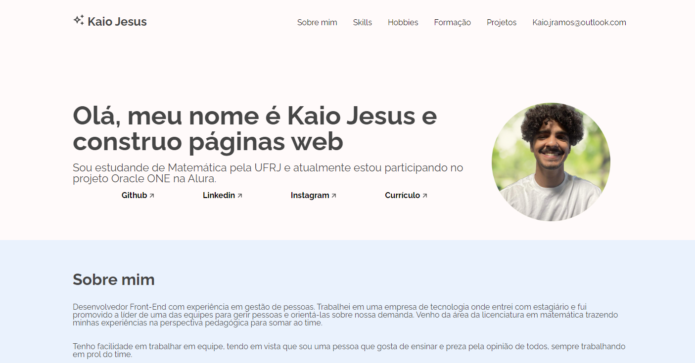
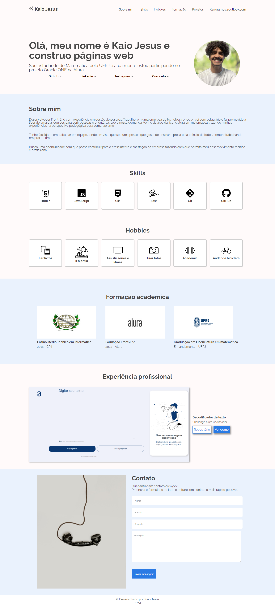
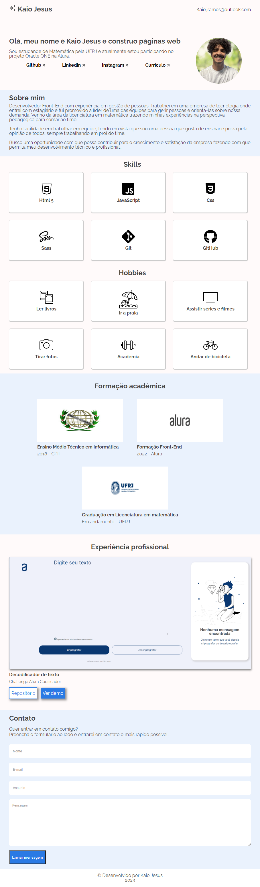
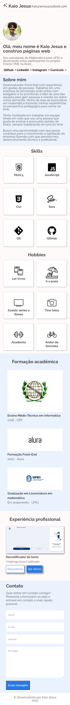

# MeuPortfolio
 
 Esta é uma página desenvolvida com a intenção de construir um portfólio pessoal e aprimorar cada vez mais minhas habilidades como desenvolvedor Front-end.  

 O desafio foi proposto pela Oracle + Alura.

  
 
 
 
 ## Conteúdos
- [Descrição](#Descrição)
- [Telas](#Telas)
- [Links](#Links)
- [Ferramentas](#Ferramentas)
- [Aprendizado](#Aprendizado)
- [Contato](#Contato)

### Descrição

Este desafio tem como objetivo a construção de um portfólio para que eu possa apresentar apresentar meus trabalhos mais relevantes e também de ser visto por recrutadores e desenvolvedores.

Neste site conta um pouco sobre mim, o que gosto de fazer, minhas habilidades, minha experiência acadêmica e um dos meus projetos feitos.

Sinta-se a vontade para entrar em contato comigo!

### Telas

#### PC min-width 1440px

#### Tablet min-width 768px

#### Smartphones

### Link

[Solution URL](https://meu-portfolio-seven-mu.vercel.app/)

### Ferramentas

- HTML 5
- CSS; SaSS
- Javascript
- Git e GitHub

### 📝 Aprendizado

Com este desafio aprendi:
- A utilizar o método forEach;
- Novos atributos de validação no HTML;
- A fazer validação de formulário com JavaScript usando o validityState;
- Aprimorar mais o uso do pré-processador SaSS;
- Praticar o display grid;
- Novos pseudoelementos e como utilizá-los;

### ✉ Contato 

- [LinkedIn](https://www.linkedin.com/in/kaio-jesus/) 
- [kaiojesus41@gmail.com](kaiojesus41@gmail.com)

